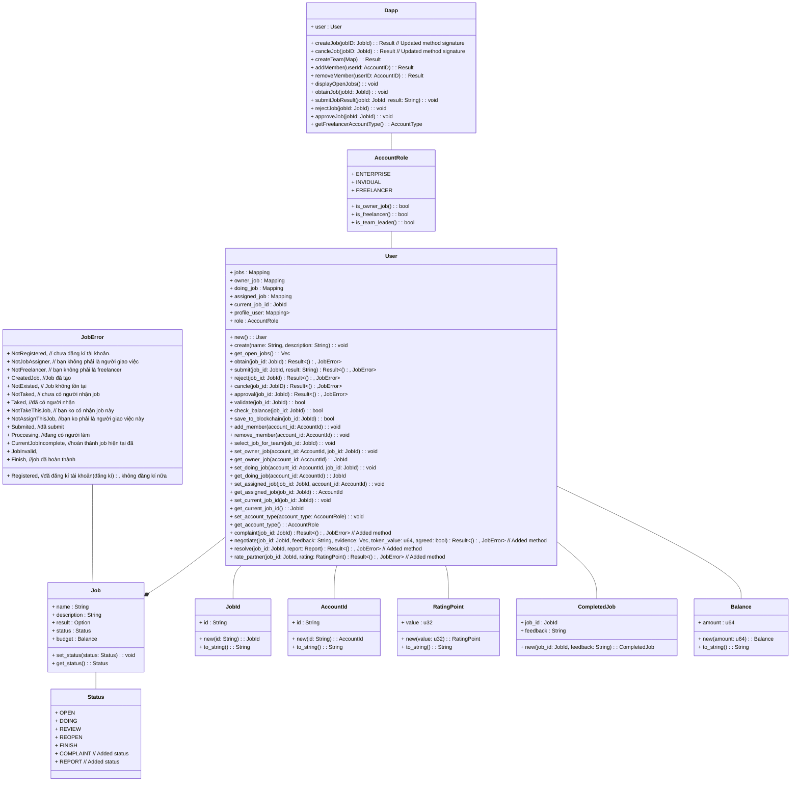

# Freelankakot: Freelancer smart contract in *Substrate node*

Freelankakot is a freelancing platform in Polkadot developed [ink!](https://github.com/paritytech/ink) programing language with [Substrate](https://substrate.io).  

- Platform for freelancers, employers and businesses
- Intergrate power of blockchain
- Built on Polkadot

## Architecture of smart contract

